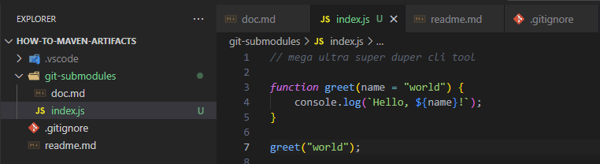
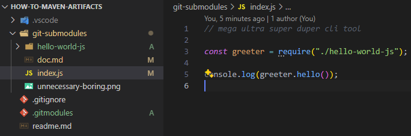

# Ergebnissicherung

## Ohne Submodule



Dieses Bild zeigt, wie man ein Hello World Programm in Javascript selbst schreiben kann.
Es ist sehr aufwendig und nicht empfehlenswert.

## Mit Submodule

Viel einfacher ist es, ein Git-Repository als Submodul einzubinden.

Dazu habe ich das Repository [Hello World](https://github.com/dhilt/hello-world-js) als Submodul eingebunden.

```bash
git submodule add https://github.com/dhilt/hello-world-js
```


