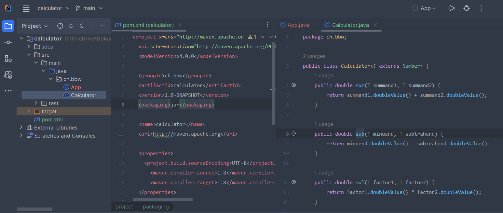
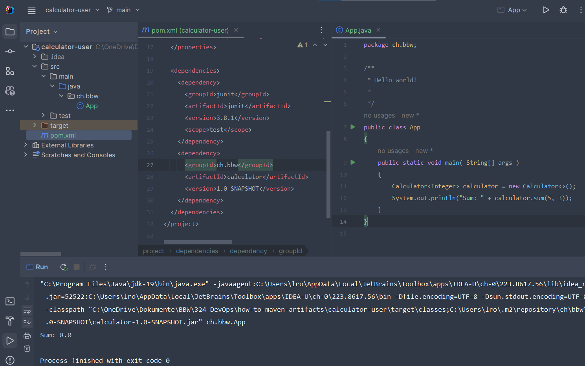
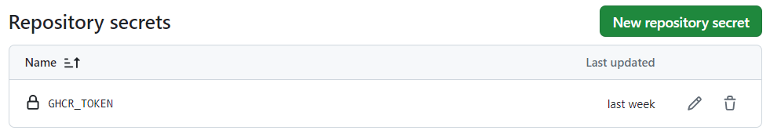
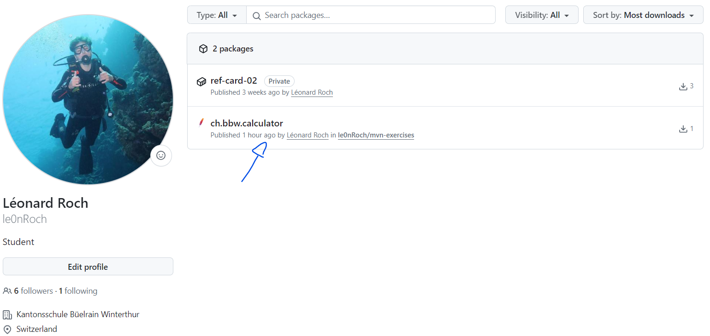

# Alles Über Maven Artefakte

Dieses Repository dient zur Ergebnissicherung der Aufgaben _Maven Artefakte_ aus dem Modul _DevOps_.

## Aufgaben

- [Git Submodule](./git-submodules/doc.md)
- [Was ist ein Maven Artefakt?](#was-ist-ein-maven-artefakt)
- [Maven Repository](#maven-repository)
- [Maven Artefakt lokal nutzen](#maven-artefakt-lokal-nutzen)
- [Maven Artefakt auf GitHub veröffentlichen](#maven-artefakt-auf-github-ver%C3%B6ffentlichen)
- [Maven Artefakt von GitHub nutzen](#maven-artefakt-von-github-nutzen)

## Was ist ein Maven Artefakt?

```xml
<project>
    <modelVersion>4.0.0</modelVersion> <!-- POM Version -->
    <groupId>org.baeldung</groupId> <!-- Gruppen ID <land>.<firma> -->
    <artifactId>org.baeldung.java</artifactId> <!-- Artefakt ID <land>.<firma>.<projekt> -->
    <packaging>jar</packaging> <!-- Verpackung jar = Java Archiv -->
    <version>1.0.0-SNAPSHOT</version> <!-- Version -->
    <name>org.baeldung.java</name> <!-- Name -->
    <url>http://maven.apache.org</url>
    <dependencies> <!-- Abhängigkeiten -->
        <dependency>
            <groupId>junit</groupId> <!-- Gruppen ID der Abhängigkeit -->
            <artifactId>junit</artifactId> <!-- Artefakt ID der Abhängigkeit -->
            <version>4.1.2</version> <!-- Version der Abhängigkeit (hier Stable) -->
            <scope>test</scope> <!-- Scope der Abhängigkeit -->
        </dependency>
    </dependencies>
</project>
```

**Classifier**:

Der Classifier ist ein optionaler Zusatz zum Artefakt. Er wird verwendet, um Artefakte mit gleicher Gruppen-ID, Artefakt-ID und Version zu unterscheiden. Ein Beispiel für die Verwendung eines Classifiers ist die Erstellung von Artefakten für verschiedene Plattformen. Ein Beispiel für einen Classifier ist: `org.baeldung.java:jar:1.0.0:tests`.

**Version**:

Die Version eines Artefakts ist eine Zeichenfolge, die die Version des Artefakts angibt. Die Version wird in der Regel in der Form `MAJOR.MINOR.PATCH` angegeben. Ein Beispiel für eine Version ist: `1.0.0`.

**Packaging**:

Das Packaging-Element gibt an, wie das Artefakt verpackt wird. Ein Beispiel für ein Packaging ist: `jar`.

**Group ID**:

Die Gruppen-ID ist eine Zeichenfolge, die die Gruppe identifiziert, die das Artefakt erstellt hat. Ein Beispiel für eine Gruppen-ID ist: `org.baeldung`. Meine Gruppen-ID ist: `ch.bbw`.

**Artifact ID**:

Die Artefakt-ID ist eine Zeichenfolge, die das Artefakt identifiziert. Ein Beispiel für eine Artefakt-ID ist: `org.baeldung.java`. Meine Artefakt-ID ist: `ch.bbw.<project>`.

Unterschied zwischen `SNAPSHOT` und `RELEASE`:

- `SNAPSHOT`: Eine SNAPSHOT-Version ist eine Version, die sich noch in der Entwicklung befindet. SNAPSHOT-Versionen können sich bei jedem Build ändern. Beispeile für SNAPSHOT-Versionen sind: `1.0.0-SNAPSHOT`, `1.0.1-SNAPSHOT`, `1.0.2-SNAPSHOT`.

- `RELEASE`: Eine RELEASE-Version ist eine Version, die für die Veröffentlichung bereit ist. RELEASE-Versionen sind stabil und sollten nicht geändert werden. Beispiele für RELEASE-Versionen sind: `1.0.0`, `1.0.1`, `1.0.2`.

## Maven Repository

**Lokales Repository auf Windows**:

```cmd
cd %USERPROFILE%\.m2\repository
```

Das Repository ist ein Verzeichnis hat eine Grösse von 1 GB.

## Maven Artefakt lokal nutzen

Als erstes habe ich ein Maven Projekt erstellt:



Es ist ein einfacher Taschenrechner, der zwei Zahlen addiert.
Ich musste noch dem Befehele `mvn install` ausführen, um das Artefakt in das lokale Repository zu installieren.

Als nächstes habe ich ein weiteres Maven Projekt erstellt und das erste Projekt als Abhängigkeit hinzugefügt:



Et voilà, ich konnte das Artefakt des ersten Projekts im zweiten Projekt verwenden.

## Maven Artefakt auf GitHub veröffentlichen

Als erstes habe ich die settings.xml Datei erstellt:

```xml
<settings xmlns="http://maven.apache.org/SETTINGS/1.0.0"
    xmlns:xsi="http://www.w3.org/2001/XMLSchema-instance"
    xsi:schemaLocation="http://maven.apache.org/SETTINGS/1.0.0 https://maven.apache.org/xsd/settings-1.0.0.xsd">

    <servers>
        <server>
            <id>github</id>
            <username>${env.GITHUB_ACTOR}</username>
            <password>${env.GITHUB_TOKEN}</password>
        </server>
    </servers>
</settings>
```

Dann habe ich die pom.xml Datei angepasst:

```xml
<distributionManagement>
    <repository>
      <id>github</id>
      <name>GitHub Packages</name>
      <url>https://maven.pkg.github.com/le0nRoch/mvn-exercises</url>
    </repository>
  </distributionManagement>
```

Als nächstes habe ich Github Secrets hinterlegt:



Zum Schluss habe ich die GitHub Actions erstellt:

```yaml
name: Maven Package

on:
  push:
    branches: [main]

jobs:
  build:
    runs-on: ubuntu-latest

    env:
      MAVEN_PROJECT_PATH: calculator/pom.xml

    steps:
      - uses: actions/checkout@v4
      - name: Set up JDK 20
        uses: actions/setup-java@v4
        with:
          distribution: "adopt"
          java-version: "20"
          server-id: github # Value of the distributionManagement/repository/id field of the pom.xml
          settings-path: ${{ github.workspace }} # location for the settings.xml file
      - name: Build with Maven
        run: mvn -B package --file ${{ env.MAVEN_PROJECT_PATH }}

      - name: Publish to GitHub Packages Apache Maven
        run: mvn deploy --file ${{ env.MAVEN_PROJECT_PATH }} -s $GITHUB_WORKSPACE/settings.xml
        env:
          GITHUB_ACTOR: ${{ github.actor }}
          GITHUB_TOKEN: ${{ secrets.GHCR_TOKEN }}
```

Et voilà, ich konnte das Artefakt auf GitHub veröffentlichen.



## Maven Artefakt von GitHub nutzen

Als erstes habe ich die settings.xml Datei erstellt:

```xml
<settings xmlns="http://maven.apache.org/SETTINGS/1.0.0"
          xmlns:xsi="http://www.w3.org/2001/XMLSchema-instance"
          xsi:schemaLocation="http://maven.apache.org/SETTINGS/1.0.0 https://maven.apache.org/xsd/settings-1.0.0.xsd">

    <servers>
        <server>
            <id>github</id>
            <username>
                <!-- GitHub Username -->
            </username>
            <password>
                <!-- Personal Access Token -->
            </password>
        </server>
    </servers>
</settings>
```

Dann habe ich die pom.xml Datei angepasst:

```xml
<project xmlns="http://maven.apache.org/POM/4.0.0" xmlns:xsi="http://www.w3.org/2001/XMLSchema-instance"
         xsi:schemaLocation="http://maven.apache.org/POM/4.0.0 http://maven.apache.org/xsd/maven-4.0.0.xsd">
    <modelVersion>4.0.0</modelVersion>

    <groupId>ch.bbw</groupId>
    <artifactId>calculator-user</artifactId>
    <version>1.0-SNAPSHOT</version>
    <packaging>jar</packaging>

    <name>calculator-user</name>
    <url>http://maven.apache.org</url>

    <properties>
        <project.build.sourceEncoding>UTF-8</project.build.sourceEncoding>
        <maven.compiler.source>1.8</maven.compiler.source>
        <maven.compiler.target>1.8</maven.compiler.target>
    </properties>


    <!-- Added repositories -->
    <repositories>
        <repository>
            <id>github</id>
            <name>Github packages</name>
            <url>https://maven.pkg.github.com/le0nRoch/mvn-exercises</url>
        </repository>
    </repositories>

    <dependencies>
        <dependency>
            <groupId>junit</groupId>
            <artifactId>junit</artifactId>
            <version>3.8.1</version>
            <scope>test</scope>
        </dependency>
        <!-- Added dependency -->
        <dependency>
            <groupId>ch.bbw</groupId>
            <artifactId>calculator</artifactId>
            <version>1.0-SNAPSHOT</version>
        </dependency>
    </dependencies>
</project>
```

Zum Schluss habe ich die Maven Befehle ausgeführt:

```cmd
mvn install -s settings.xml
```

Et voilà, ich konnte das Artefakt von GitHub nutzen.
